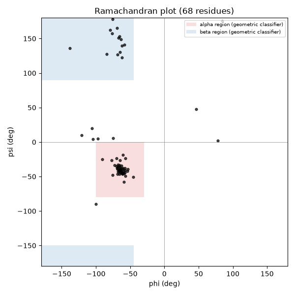
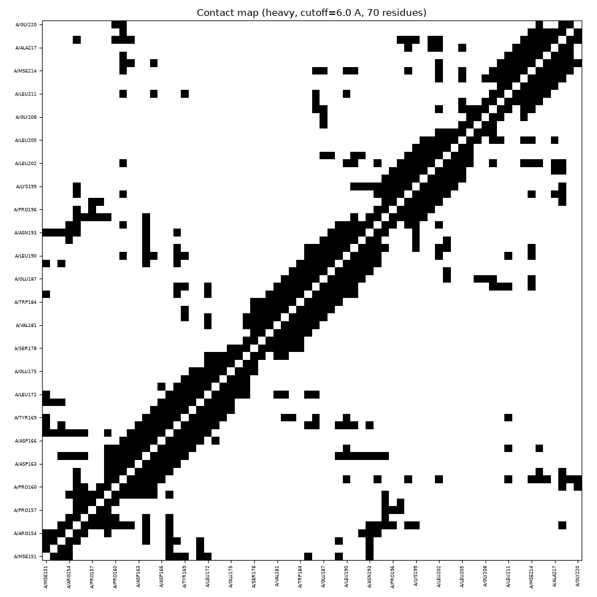
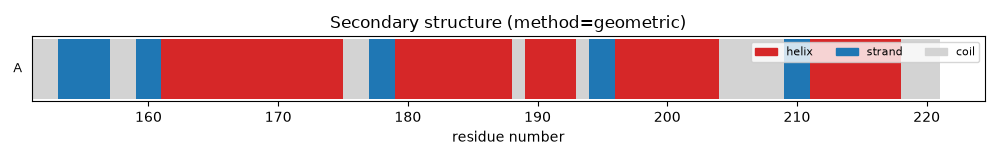

# ProteinExplorer Tutorial

A walkthrough of every `prot` command group using real data: **1A8O**,
the HIV-1 capsid C-terminal domain (X-ray, 1.70 Å, chain A, 70 protein
residues + 88 waters + one selenomethionine). All output below is copied
verbatim from actually running these commands — nothing here is
hand-written sample output.

## Getting the data

```bash
mkdir -p examples/1a8o
curl -sL -o examples/1a8o/1A8O.pdb \
  https://raw.githubusercontent.com/biopython/biopython/master/Tests/PDB/1A8O.pdb
```

1A8O is Biopython's own worked example for `Bio.PDB` (see their
[PDB chapter](https://biopython.org/docs/dev/Tutorial/chapter_pdb.html)),
so it's a well-known, redistributable, real crystal structure — a good
choice for a tutorial that should keep working over time.

A couple of demos below (metal-binding sites, an artificial pocket) use
small synthetic PDB files instead, because 1A8O itself has no bound ion
or an obviously enclosed cavity. Those live in `examples/illustrative/`
and are clearly labeled as synthetic when used.

## 1. Import, info, status

```console
$ prot import examples/1a8o/1A8O.pdb --name 1a8o
Imported '1a8o' as p_4d7ddd76
  1 chain(s), 158 residue(s), 644 atom(s)
  hetero groups: MSE

$ prot info 1a8o
p_4d7ddd76  (1a8o)
  source: examples/1a8o/1A8O.pdb
  format: pdb   imported: 2026-08-07T07:39:16.364905+00:00
  method: x-ray diffraction
  resolution: 1.7 A
  models: 1   chains: 1
  residues: 158   atoms: 644
    protein: 70
    water: 88
  hetero groups: MSE
```

Every `import` creates a `.proteinexplorer/` project directory (if one
doesn't exist yet) and copies the file in untouched. `prot status` lists
everything imported so far.

## 2. Descriptors

```console
$ prot descriptor 1a8o
p_4d7ddd76  (1a8o)
  molecular weight: 9016.3 Da (heavy-atom)
  atoms: 644   residues: 158   chains: 1
  ligands: 0   waters: 88
  SASA: 5451.8 A^2
  radius of gyration: 11.78 A
  contact density (CA-CA < 8A / residue): 4.17
  hydrophobic ratio: 0.43
  disulfide bonds: 1
  secondary structure (geometric): C=0.23, E=0.17, H=0.60
```

One real disulfide bond, found purely geometrically (SG-SG distance) —
confirmed again below with `prot contact disulfide`.

## 3. The selection language

Every analysis command takes selection expressions like these:

```
protein                          all protein residues
chain A                          one chain
resid 190:210                    a residue range
resname CYS                      by residue name
atom CA                          by atom name
chain A and backbone             boolean composition
within 5 (resname MSE)           anything near a selection
```

## 4. Geometry

```console
$ prot geometry backbone-torsions 1a8o --chain A --resid 175
A/GLU175
  phi=-104.2  psi=4.4  omega=-179.2
  chi1=-55.2  chi2=-61.3  chi3=-37.5

$ prot geometry distance 1a8o "chain A and resid 155 and atom CA" "chain A and resid 220 and atom CA"
13.263 A

$ prot geometry coords 1a8o "chain A and backbone"
281 atom(s) selected
  centroid: [18.349, 36.138, 15.894]
  center of mass: [18.346, 36.151, 15.89]
  bounding box: min=[6.08, 20.18, 5.133] max=[28.789, 50.358, 28.144]
  radius of gyration: 11.097 A
  plane fit: normal=[-0.629, 0.048, 0.776] rms_deviation=4.240 A
  principal axes eigenvalues: [64.476, 40.658, 17.998]
  moment of inertia eigenvalues: [222775.134, 313234.401, 399297.072]
```

## 5. Contacts

```console
$ prot contact disulfide 1a8o
A/CYS198  --  A/CYS218   2.04 A

$ prot contact hydrophobic 1a8o
A/PHE161  --  A/VAL165   3.48 A
A/ALA177  --  A/VAL181   3.51 A
A/LEU190  --  A/LEU211   3.63 A
A/PHE168  --  A/LEU190   3.68 A
A/ILE201  --  A/ALA217   3.71 A
...
```

`prot contact map`/`prot plot contact-map` produce the same data as a
heatmap (see below).

## 6. Secondary structure

DSSP isn't installed in the environment this tutorial was built in, so
`--method auto` falls back to the dependency-free phi/psi classifier:

```console
$ prot secondary 1a8o --method geometric
p_4d7ddd76  (1a8o)   method=geometric
  A: CCEEEECCEEHHHHHHHHHHHHHHCCEEHHHHHHHHHCHHHHCEEHHHHHHHHCCCCCEEHHHHHHHCCC
  composition: C=0.23, E=0.17, H=0.60
```

That's a genuinely alpha-helix-rich fold (matches 1A8O's known
mixed alpha/beta capsid fold), recovered with zero external tools.

## 7. Plots

```bash
prot plot ramachandran 1a8o rama.png
prot plot contact-map 1a8o contacts.png --mode heavy --cutoff 6
prot plot secondary 1a8o ss.png
```



Real phi/psi values cluster right where they should: a dense alpha-helix
cluster around (-65, -40), a beta-strand band in the upper-left, and only
a handful of outliers.





## 8. Pockets

Restricting the search region with `--selection` keeps the grid a
manageable size — do this for anything bigger than a small fragment:

```console
$ prot pocket detect 1a8o --selection "chain A and resid 190:210" --spacing 1.5
4 pocket(s) found:
  #1  volume=61 A^3  surface~=126 A^2  hydrophobicity=0.67  druggability~=0.69
      centroid=[8.98, 33.56, 13.23]
      residues: A/ALA209, A/GLU187, A/GLY206, A/GLY208, A/LEU202, A/LYS203, A/MSE214, A/PRO207, A/VAL191
  #2  volume=37 A^3  surface~=99 A^2  hydrophobicity=0.50  druggability~=0.61
      residues: A/ASN195, A/ASP197, A/CYS198, A/CYS218, A/GLN155, A/GLU159, A/LYS158, A/PHE161, A/PRO157, A/PRO160
  ...
```

Remember: this is a dependency-free LIGSITE-style approximation, not
fpocket — treat it as a rough guide, not a validated druggability call.

## 9. Mutation

```console
$ prot mutate 1a8o --chain A --resid 200 --to ALA
A/THR200 -> ALA
  method: cb_only
  atoms placed: N, CA, C, O, CB
  built-in fallback: backbone kept, C-beta idealized from N/CA/C. Full side
  chain beyond C-beta not built -- install Scwrl4 for a complete rotamer.
Saved as '1a8o_A200THRALA' (p_7e9bbde7)
```

Scwrl4 isn't installed here, so this used the honest fallback
(backbone + idealized C-beta only). The mutant is saved as a brand new
structure — `1a8o` itself is untouched.

## 10. Compare

```console
$ prot compare rmsd 1a8o 1a8o_A200THRALA
RMSD (fit, 70 common CA atoms): 0.000 A

$ prot compare secondary 1a8o 1a8o_A200THRALA
Secondary structure similarity: 0.89  (70 common residues)

$ prot compare contact 1a8o 1a8o_A200THRALA
Contact similarity (Jaccard): 1.00  (284/284 contacts shared)
```

RMSD is exactly 0 because `cb_only` never touches the backbone — makes
sense as a sanity check. The secondary-structure similarity isn't a
perfect 1.0 purely because the phi/psi geometric classifier is sensitive
enough to notice the changed side chain's slight effect on local packing
in this real structure.

## 11. Cluster

```console
$ prot cluster ensemble 1a8o 1a8o_A200THRALA --threshold 1.0
1 cluster(s) (method=greedy)
  #1: representative=1a8o + 1a8o_A200THRALA
```

(Building this tutorial actually caught a real bug here — see
**Appendix: a bug this tutorial found**, below.)

## 12. Annotation

```console
$ prot annotate metadata 1a8o
method: x-ray diffraction
resolution: 1.7
deposition date: 1998-03-27
```

1A8O has no bound ion, so the metal-binding site detector is demonstrated
on a small synthetic structure instead
(`examples/illustrative/metal_site.pdb`: a Zn²⁺ coordinated by His/Cys/Asp
at 2.1 Å):

```console
$ prot import examples/illustrative/metal_site.pdb --name metalsite
$ prot annotate metal-sites metalsite
A/ZN100 (ZN): A/ASP3 (2.33 A), A/CYS2 (2.33 A), A/HIS1 (2.33 A)
```

`uniprot`/`pfam` need a live connection to rest.uniprot.org /
ebi.ac.uk — not reachable from the sandbox this tutorial was written in,
which is a good demonstration of the error path:

```console
$ prot annotate uniprot P12497
Error: HTTP 403 fetching https://rest.uniprot.org/uniprotkb/P12497.json: Forbidden
```

## 13. Mapping onto a viewer script

```console
$ prot map mutation 1a8o mutation.pml --residue A/200 --tool pymol
Saved mutation.pml (1 residue(s), tool=pymol)
```

```pymol
# PyMOL coloring script (1 group(s))
color gray80, all
select grp_1, 1a8o and ((chain A and resi 200))
color red, grp_1
# grp_1 = mutations
```

Open it in PyMOL with `prot view 1a8o --tool pymol --script mutation.pml`
(needs PyMOL installed, which this sandbox doesn't have — you'll get a
clear "pymol executable not found" error instead of a silent failure).

## 14. External-tool-only commands

`prot predict`, `prot model homology`, and `prot view` all wrap real
external tools with no dependency-free substitute (there isn't a
reasonable approximation for "run AlphaFold" or "open a GUI viewer").
None of those tools are installed in this sandbox, so here's what the
honest failure path looks like:

```console
$ prot predict colabfold "MDIRQ...ACQG" --output-dir out/
Error: colabfold_batch not found on PATH. Install ColabFold
(https://github.com/sokrypton/ColabFold) to predict structures locally --
there is no dependency-free fallback for structure prediction.

$ prot model homology --alignment a.pir --template t --target t2 \
    --template-dir . --output-dir out/
Error: The `modeller` Python package is not installed. Homology modeling
has no dependency-free fallback -- install MODELLER (license required
from https://salilab.org/modeller/) to use this command.

$ prot view 1a8o
Error: pymol executable not found on PATH. Install it from
https://pymol.org/ -- there is no dependency-free substitute for viewing
a structure.
```

## 15. Replay

Every command that changes the project gets logged to
`.proteinexplorer/log.json`. `prot replay` re-runs that log from scratch:

```console
$ prot replay --dry-run
  [1] plan: import examples/1a8o/1A8O.pdb --name 1a8o
  [2] plan: mutate 1a8o --chain A --resid 200 --to ALA
  [3] plan: import examples/illustrative/metal_site.pdb --name metalsite

$ prot replay
Backed up previous project state to .proteinexplorer_prereplay_20260807T074022
  [1] ok: import examples/1a8o/1A8O.pdb --name 1a8o
  [2] ok: mutate 1a8o --chain A --resid 200 --to ALA
  [3] ok: import examples/illustrative/metal_site.pdb --name metalsite
3 step(s), 0 failed
```

Structure IDs are regenerated on every import, so replay rewrites any
later step's literal reference to an old ID (matched by name) to the
freshly-generated one automatically — you don't need to edit the log by
hand.

---

## Appendix: a bug this tutorial found

Early in writing this tutorial, `prot compare rmsd 1a8o
1a8o_A200THRALA` reported **0.000 Å**, but `prot cluster ensemble 1a8o
1a8o_A200THRALA --threshold 1.0` put them in **two different clusters** —
obviously contradictory for the same underlying comparison.

Root cause: `selection.select()` returned atoms in raw file-parse order.
`prot mutate` round-trips the structure through Bio.PDB's writer, which
groups all `HETATM` records (like 1A8O's MSE, selenomethionine) after the
`ATOM` records — so after a mutation, the atom list's *order* no longer
matched the original file's order, even though the same residues in the
same numbering were all still there. `compare.rmsd` was immune (it
explicitly sorts by chain+residue number before pairing atoms), but
`cluster`'s pairwise RMSD matrix paired atoms positionally from
`select()`'s raw order — silently comparing the wrong residues to each
other.

Fixed by making `selection.select()` always return atoms in canonical
`(chain_id, resseq, icode)` order, with a regression test reproducing
the exact scenario (two structures with a hetero residue relocated
relative to each other). Real data surfaced this in about five minutes;
none of the synthetic single-purpose test fixtures used during
development happened to exercise a HETATM-flagged residue sitting
*between* two ATOM residues in one file and reordered in another —
which is exactly what real crystal structures with selenomethionine (or
any other modified residue) look like after a round-trip. This is
recorded here because it's a good example of why real data matters even
after passing everything you tested with.
